# AWS Lambda function performance


Radek Švanda <radek.svanda@aurora.io>

<!--
-->

----

## Topics

- Lambda function lifecycle
- General recommendations
- Active tracing
- Application overview
- Kotlin
- Java
- GraalVM

----

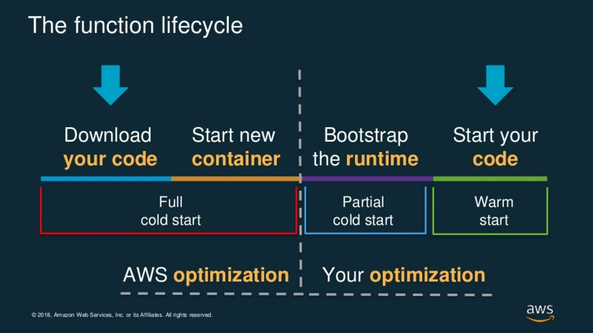

<!--
When VPC is involved a Network Interface is created or assigned to the Lambda
During the full cold start
-->

----

## Easy wins

- Remove unnecessary dependencies
  Smaller package = faster upload & faster cold start
  ```
  mvn dependency:tree
  ```

* JDK JIT compiler C1 only - almost 100% speed gain instantly
  ```yaml
  Environment
    Variables:
      JAVA_TOOL_OPTIONS: "-XX:+TieredCompilation -XX:TieredStopAtLevel=1"
  ```

<!--
JVM is fast because it can adapt to the paths your code uses during runtime
Lambda is short life, single thread, simple environment, does not need that
-->


* Initialize as much as possible during start-up (**but only what you really need**)

<!--
Beware shared codebase for lambdas with different purpose
(REST endpoint, Kafka client, ...)
-->

----

## Kotlin cold start (without JVM params) [🔗](https://eu-west-2.console.aws.amazon.com/cloudwatch/home?region=eu-west-2#xray:traces/1-6352641a-03093dcd66a913fd00a682ac?~(query~()~context~(timeRange~(end~'2022-10-21T10*3a30*3a00.000Z~start~'2022-10-21T09*3a00*3a00.000Z))))

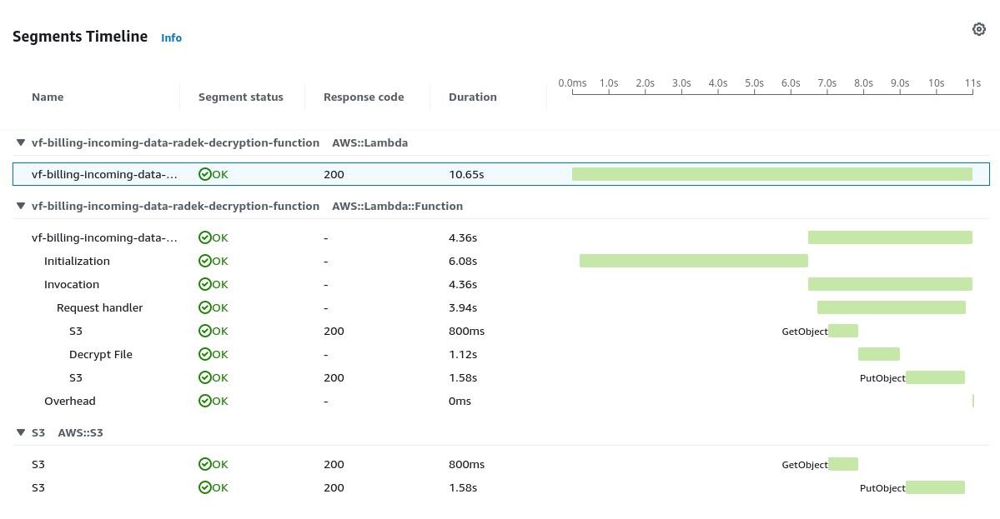

----

## Kotlin cold start (with JVM params)

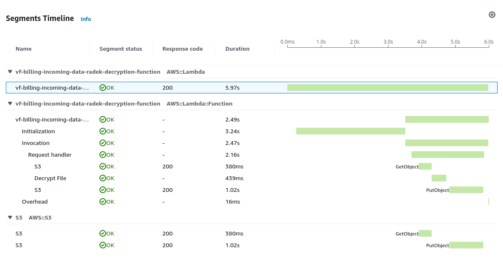

----

- Exclude AWS SDK http clients - you run in a single thread you do not need NIO

  ```xml
  <dependency>
    <groupId>software.amazon.awssdk</groupId>
    <artifactId>url-connection-client</artifactId>
  </dependency>
  <groupId>software.amazon.awssdk</groupId>
    <artifactId>s3</artifactId>
    <exclusions>
      <exclusion>
        <groupId>software.amazon.awssdk</groupId>
        <artifactId>apache-client</artifactId>
      </exclusion>
      <exclusion>
        <groupId>software.amazon.awssdk</groupId>
        <artifactId>netty-nio-client</artifactId>
      </exclusion>
    </exclusions>
  </dependency>
  ```
<!--
Prefer using SDK2
Lambda is a single thread environment, and URLClient instance should
be enough for most cases
-->

----

- Fully configure AWS SDK clients
  ```java
  S3Client.builder()
    .region(Region.of(System.getenv("AWS_REGION")))
    .httpClient(UrlConnectionHttpClient.builder().build()).build()
  ```

<!--
When not fully configured the SDK client parses a huge JSON file
to get values for its properties
-->

* Use [smart configuration defaults](https://aws.amazon.com/blogs/developer/introducing-smart-configuration-defaults-in-the-aws-sdk-for-java-v2/)
  ```java
  S3Client.builder().defaultsMode(DefaultsMode.IN_REGION).build()
  ```

<!--
Optimizes some runtime configuration variables for the application
(single region, mobile, cross region, auto)
-->


* Ditch sophisticated logging
  ```java
  override fun handleRequest(input: SQSEvent, context: Context) {
    context.logger.log("hello there")
  ```
  Falls back to
  ```java
  public void log(String message) { System.out.print(message) }
  ```

<!--
In most cases you should be able to find the problem without
having logs in JSON format

-->

----

- Remove cold starts with provisioned concurrency
  ```yaml
  Properties:
    ProvisionedConcurrencyConfig:
      ProvisionedConcurrentExecutions: 20
  ```
  May get too expensive & slows down deployment
  &rarr; not a good solution for development environment

  https://lumigo.io/blog/provisioned-concurrency-the-end-of-cold-starts/

----

- Keep lambdas warm yourself
  Better for development environment

  ```yaml
  Properties:
    Events:
      Warmer:
        Type: Schedule
        Properties:
          Schedule: rate(5 minutes)
          Description: Lambda calling at scheduled time
          Input: '{ "warmer":true,"concurrency":1 }'
  ```

  ```kotlin
  class GatewayRequest( var warmer: Boolean = false, var concurrency: Int = 1 ) : APIGatewayProxyRequestEvent()

  private val client: LambdaClient = LambdaClient.builder().build()

  override fun handleRequest(input: GatewayRequest, context: Context): APIGatewayProxyResponseEvent? {
    if (input.warmer) {
      val request = InvokeRequest.builder()
        .functionName(context.functionName)
        .payload("{ \"warmer\":true,\"concurrency\":${input.concurrency - 1} }").build()
      client.invoke(request)
    } else {
      ...
    }
  ```


----

## Tracing the function with XRay

- Opentelemetry (preferred, flexible) vs. X-Ray SDK (tight integration)

* Turn on the tracing
  ```yaml
  MyFunction:
    Type: AWS::Serverless::Function
    Properties:
      Tracing: Active
  ```

<!--
Switching on the tracing does not actually trace the function.
Just starts a tracing server
-->


* Send tracing data (use BOM `aws-xray-recorder-sdk-bom` for versioning)
  ```xml
  <dependency>
    <groupId>com.amazonaws</groupId>
    <artifactId>aws-xray-recorder-sdk-aws-sdk-v2</artifactId>
  </dependency>
  ```

<!--
You can use also the *instrumentor* library for basic automatic configuration
-->

----

## Tracing Subsegments

- Anywhere in your code
  ```kotlin
  override fun handleRequest(input: SQSEvent, context: Context) {
    AWSXRay.beginSubsegment("Request handler")
    try { ... }
    finally { AWSXRay.endSubsegment() }
  }
  ```

<!--
Beware: Segments (lambda, s3, sqs, ...) vs. Subsegments (downstream calls)
-->


- AWS SDKs
  ```kotlin
  S3Client.builder()
    .overrideConfiguration(ClientOverrideConfiguration.builder()
        .addExecutionInterceptor(TracingInterceptor()).build()
    )
  ```

----

## Example timeline

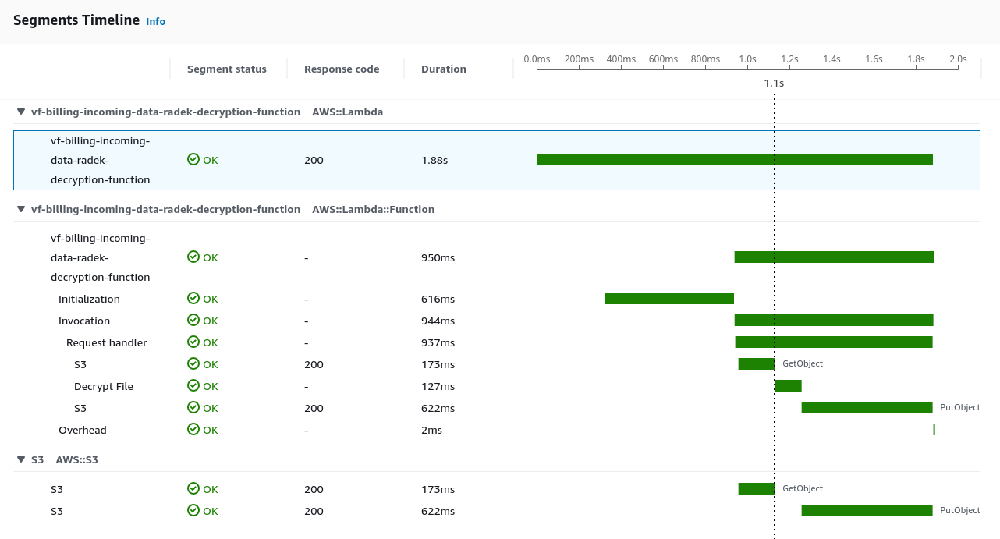

----

## Application overview

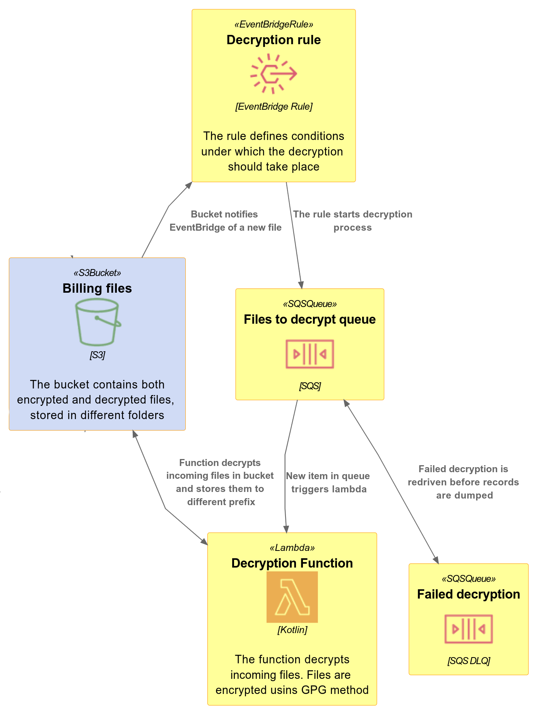

### Decryption function

- Written in Kotlin
- Steps:
  - Downloads file from S3
  - Decrypts contents with PGP
  - Uploads decrypted file back

----

## Performance testing

- ~2.500 PGP encrypted files
- Uploaded at once to source S3 bucket

#### File size distribution

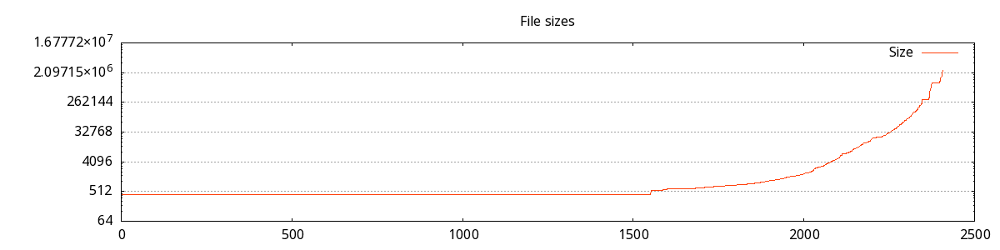

----

## 1st iteration: Micronaut framework

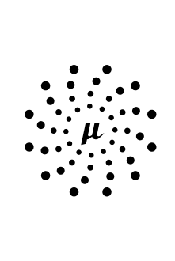

Pros:

- Out of the box Spring framework replacement
- Test tooling with mocking and spock integration
- Integration with ParamStore / SecretsManager

Problems:

- Package too large
- Slow starts
- Every. Single. One. Configuration property requested from ParamStore during startup

----

## 2nd iteration: Plain Kotlin

- Removed Micronaut
- Makefile packaged
- Most parameters configured during deployment

Pros:

- Smaller package, faster deploy

Cons:

- Manual configuration handling
- Params security (visible variables in Lambda console)

----

## Kotlin cold start [🔗](https://eu-west-2.console.aws.amazon.com/cloudwatch/home?region=eu-west-2#xray:traces/1-635fda04-72537c320cb0bf6342c4bed7?~(query~()~context~(timeRange~(delta~900000))))

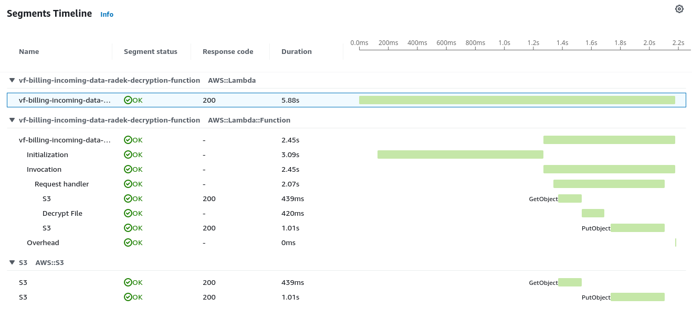

----

## Kotlin response time distribution

| Percentile | ms |
|-----|---:|
| P50 | 120 |
| P95 | 390 |
| P99 | 4700 |
| Max | 5883 |

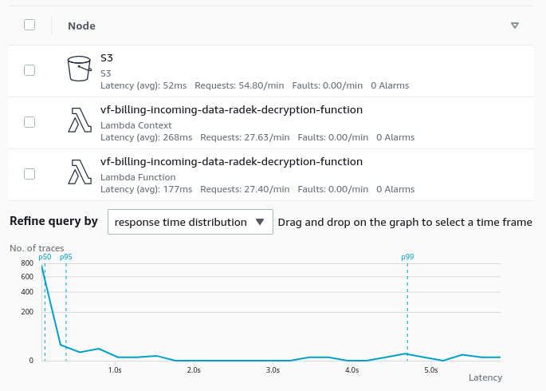

----

## 3rd iteration: Back to Java 11

- Is a plain Java application faster in Lambda environment?
- Is Kotlin more expressive but also faster?

----

## Java cold start

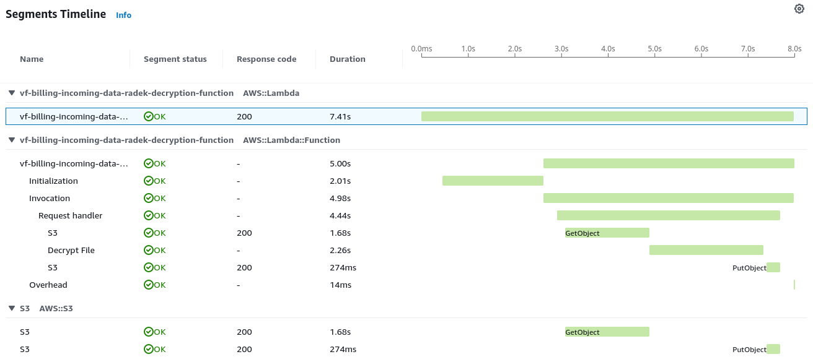

----

## Java response time distribution [🔗](https://eu-west-2.console.aws.amazon.com/cloudwatch/home?region=eu-west-2#xray:traces/query?~(query~()~context~(timeRange~(end~'2022-10-21T13*3a34*3a00.000Z~start~'2022-10-21T13*3a32*3a00.000Z))))

| Percentile | ms | Kotlin |
|-----|---:|---:|
| P50 | 130 | 120 |
| P95 | 413 | 390 |
| P99 | 6800 | 4700 |
| Max | 8328 | 5883 |

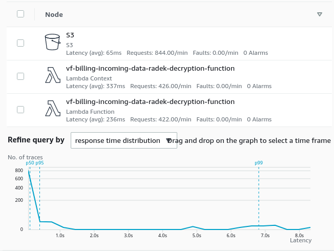

----

## 4th iteration: GraalVM native-image

- an ELF linux binary build from Java bytecode. See https://www.graalvm.org/22.3/reference-manual/native-image/

Pros:

- A fast binary
- Small package to upload
  80 MB binary package &rarr; 20 MB zipped upload

Cons:

- Everything has to be baked in during compile time
  No reflection during runtime (DI frameworks, logging, security ...)
- Sloooow build times (2-3 minutes, 12 CPU cores on 100%, peak mem 5-6GB)

----

## AWS Lambda custom runtimes

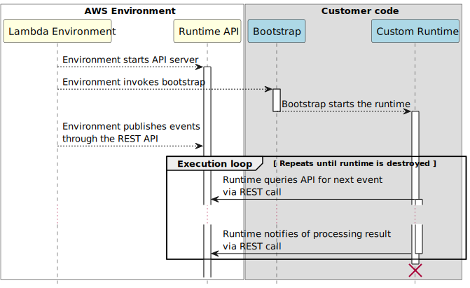

----

## GraalVM cold start

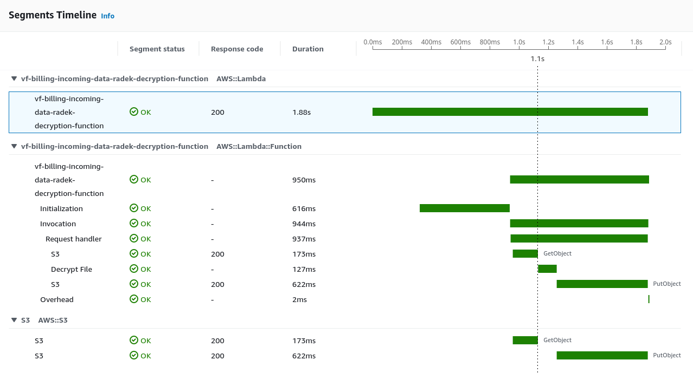

----

## GraalVM warmed request

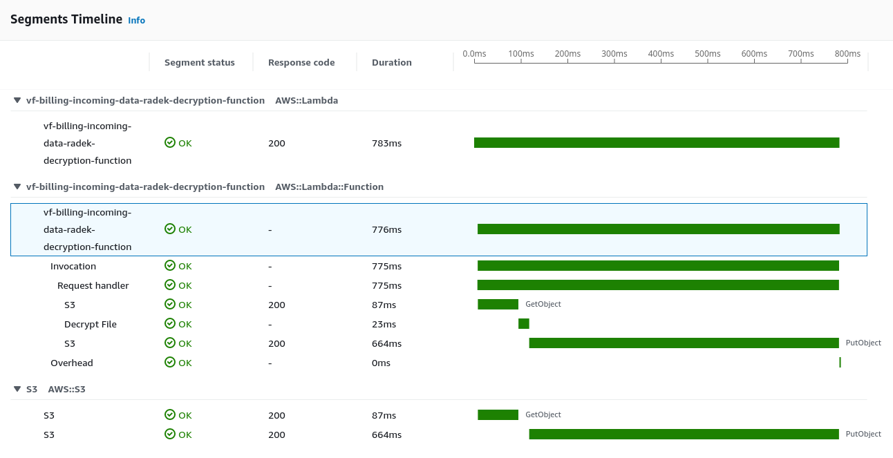

----

## GraalVM response time distribution

| Percentile | ms |
|-----|---:|
| P50 | 84 |
| P95 | 286 |
| P99 | 954 |
| Max | 2064 |

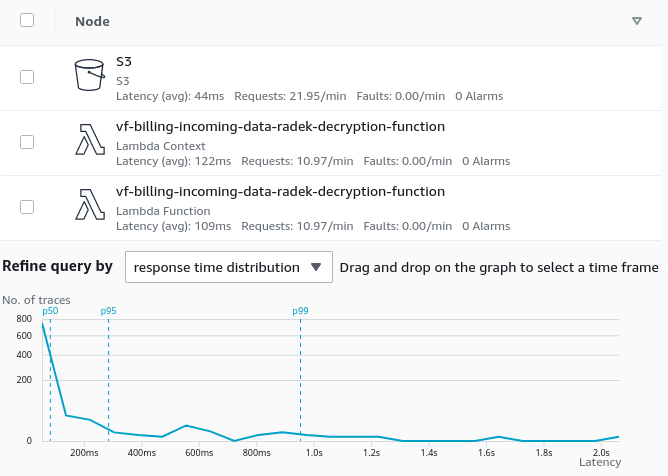

----

## Let's try something different: Javascript

Pros:

- Everybody knows it
- No build time
- Small packages, fast uploads

Cons:

- 3 different versions of AWS SDK
- AWS documentation not on par with Java

<!--
Uploads even faster with Layers
-->

----

## Node.js cold start

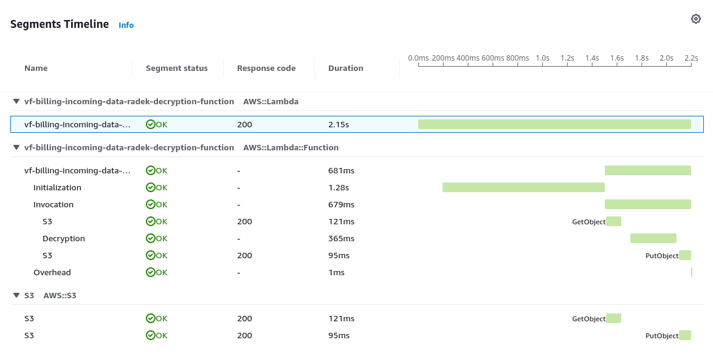

----

## Node.js warm run

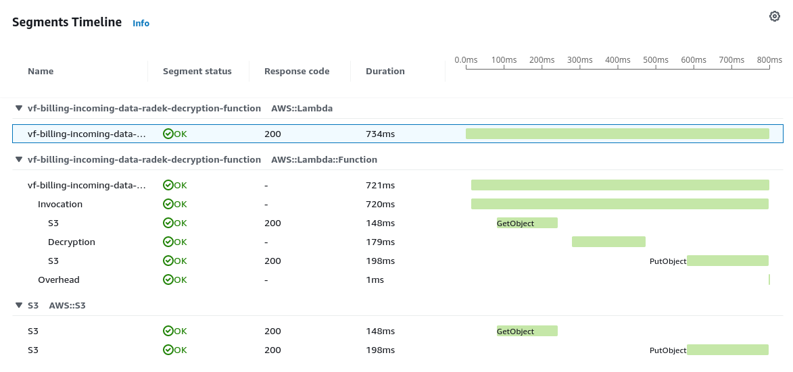

----

## Node.js response time distribution

| Percentile | ms |
|-----|---:|
| P50 | 75 |
| P95 | 279 |
| P99 | 734 |
| Max | 2160 |

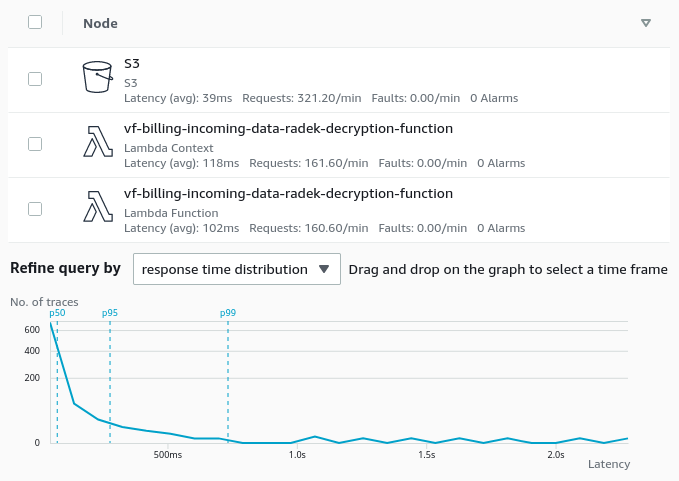

----

## Response time summary

| Lang     | P95    | P99   | Max |
|----------|-------:|------:|----:|
| Kotlin   | 390    | 4700  | 5883 |
| Java     | 413    | 6800  | 8328 |
| GraalVM  | 286    | 954   | 2065 |
| Node.js  | 279    | 734   | 2160 |

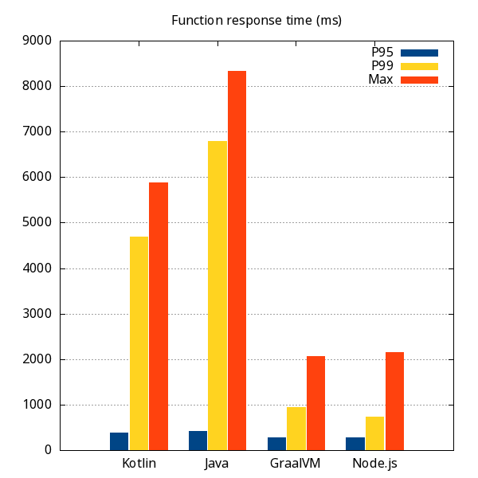

----

## Cold starts

| Language  | Count  |
|---|---|
| Kotlin  |  30 |
| JAVA  |  28 |
| Graal  |  17 |
| Node  |  17 |

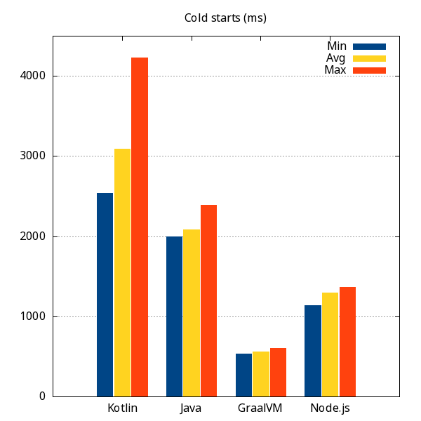

<!--
Number of cold starts
- JAVA 28
- Kotlin 30
- Graal 17
- Node 17
-->

----

## Results with provisioned concurrency

| Lang  | P50   | P95    | P99   | Max |
|-----------|------:|-------:|------:|-----:|
| Kotlin    | 109   | 414    | 1500  | 2460 |
| Java      | 99    | 360    | 850   | 1599 |
| GraalVM   | 67    | 260    | 618   | 902 |
| Node.js   | 67    | 247    | 503   | 894 |

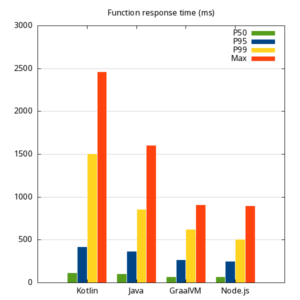

<!--

No hard data on this - RAM usage

- Java & Kotlin cca. 210 MB
- Node.js 130 MB
- Graal 80 MB

-->

----

## Summary

- Keep your Lambda functions small and simple
- Consider Java if your concern is low latency
  - easier GraalVM compilation later
  - Use Java SDK 2 with targeted configuration
  - Avoid reflection
- Consider Javascript if not sure (with Node SDK v3)

<!--
Reflection: slower during startup, complicates native image compilation

https://filia-aleks.medium.com/aws-lambda-battle-2021-performance-comparison-for-all-languages-c1b441005fd1
-->

----

# Thanks for your attention


Radek Švanda
[radek.svanda@aurora.io](radek.svanda@aurora.io)
